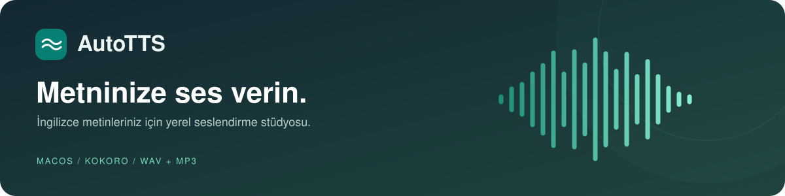

<p align="center">
  
</p>

<p align="center">
  <strong>Yazın. Bir ses seçin. Dinleyin.</strong><br>
  Kokoro tabanlı, macOS Apple Silicon için geliştirilmiş yerel İngilizce seslendirme uygulaması.
</p>

<p align="center">
  
  
  
  
</p>

<p align="center">
  <a href="#özellikler">Özellikler</a> ·
  <a href="#kurulum">Kurulum</a> ·
  <a href="#kullanım">Kullanım</a> ·
  <a href="#geliştirme">Geliştirme</a> ·
  <a href="#tez-ve-izlenebilirlik">Tez ve izlenebilirlik</a>
</p>

---

## Özellikler

AutoTTS, metin düzenlemeyi, ses üretimini ve dinlemeyi aynı çalışma alanında buluşturur. Metninizi hazırlayın, ses karakterini ve hızını seçin; sonucu zaman çizelgesinden inceleyip istediğiniz formatta kaydedin.

| | Özellik | Neler yapabilirsiniz? |
| :---: | :--- | :--- |
| **01** | **28 İngilizce ses** | ABD ve Britanya aksanlarında kadın ve erkek sesleri arasından seçim yapın. |
| **02** | **Ayarlanabilir hız** | Konuşma hızını **0.5x–2.0x** arasında belirleyin. |
| **03** | **Zaman çizelgesi** | Oynatın, duraklatın, konum seçin veya **±10 saniye** sarın. |
| **04** | **Dalga görünümü** | Üretilen sesin dalgasını ve oynatılan bölümünü görün. |
| **05** | **WAV / MP3 kayıt** | Formatı açıkça seçip sesi istediğiniz konuma kaydedin. |
| **06** | **Toplu seslendirme** | Birden fazla TXT dosyasını sırayla işleyin; hatalı dosya diğerlerini durdurmasın. |
| **07** | **Stüdyo arayüzü** | Geniş editör, kelime/karakter sayacı ve **⌘+Enter** kısayoluyla çalışın. |
| **08** | **MPS / CPU** | Uygun cihazda MPS kullanın; desteklenmediğinde CPU ile devam edin. |

> [!NOTE]
> Kullanıcı metni uzak bir TTS API'sine gönderilmez. İlk kullanımda model, ses ve dil kaynakları internetten indirilir. Gerekli kaynaklar önbellekteyken ses üretimi yerel olarak çalışır.

## Kurulum

### 1. Ortamı hazırlayın

**Gerekenler:** macOS Apple Silicon, Python 3.11 ve Tk desteği. İlk model kurulumu için internet bağlantısı gerekir.

Homebrew kullanıyorsanız:

```bash
brew install python@3.11 python-tk@3.11 espeak-ng
```

Alternatif olarak Tk destekli Python.org macOS universal2 dağıtımını kullanabilirsiniz. macOS'un sistem Python'u yerine proje için Python 3.11 tercih edin.

### 2. Projeyi indirin ve bağımlılıkları kurun

```bash
git clone https://github.com/RuslanAeff/AutoTTS.git
cd AutoTTS

python3.11 -m venv .venv
source .venv/bin/activate

python -m pip install --upgrade pip
python -m pip install -r requirements.txt
python -m spacy download en_core_web_sm
```

### 3. Uygulamayı açın

```bash
python main.py
```

Sonraki açılışlarda proje klasöründen tek komut yeterlidir:

```bash
.venv/bin/python main.py
```

<details>
<summary><strong>Kurulumda sorun mu var?</strong></summary>

<br>

| Belirti | Kontrol / çözüm |
| :--- | :--- |
| `_tkinter` bulunamıyor | Tk destekli Python kurun ve sanal ortamı o Python ile yeniden oluşturun. `python -m tkinter` test penceresi açmalıdır. |
| İlk seslendirme uzun sürüyor | Model ve seçilen ses indiriliyor olabilir. Durum mesajını ve internet bağlantısını kontrol edin. |
| İngilizce dil kaynağı yüklenemiyor | Aktif sanal ortamda `python -m spacy download en_core_web_sm` çalıştırın. |
| Önizleme oynatılamıyor | Ses çıkış aygıtını kontrol edin ve `python -m pip install -r requirements.txt` ile AVFoundation bağlantısının kurulduğundan emin olun. |
| MP3 yazımı desteklenmiyor | Soundfile/libsndfile kurulumunu kontrol edin. Alternatif olarak WAV seçebilirsiniz; ek FFmpeg bağımlılığı gerekmez. |

Model ve ses önbelleği `.cache/huggingface/` klasörüdür; `HF_HOME` ortam değişkeniyle konumu değiştirilebilir. G2P dil paketi sanal ortama kurulur.

</details>

## Kullanım

### Metinden sese

1. **Metin editörüne** İngilizce metninizi yazın veya yapıştırın.
2. **Ses ayarlarından** sesi ve konuşma hızını seçin.
3. **Seslendir** düğmesine basın veya **⌘+Enter** kullanın.
4. Alttaki **oynatıcıdan** sonucu dinleyin; zaman çizelgesini sürükleyerek istediğiniz konuma geçin.
5. **Dışa aktar** alanından **WAV** veya **MP3** seçin, ardından **Kaydet** ile hedefi belirleyin.

> [!TIP]
> MP3 kaydetmek için **Kaydet düğmesinin yanındaki menüyü** kullanın. Sağdaki toplu işlem kartının format seçimi yalnız toplu çıktılar için geçerlidir.

Duraklatılmış seste konum seçmek oynatmayı başlatmaz; **Devam et** ile seçtiğiniz yerden dinleyebilirsiniz. Sesin sonundayken **Oynat** baştan başlatır.

### Birden fazla dosyayı seslendirme

1. **Toplu seslendirme → TXT dosyaları** ile UTF-8 metin dosyalarını seçin.
2. Aynı karttan çıktı formatını belirleyin.
3. **Toplu seslendir** düğmesine basıp hedef klasörü seçin.

Her çalışma ayrı bir `AutoTTS-…` klasörü oluşturur. Çıktılar seçilen dosya sırasına göre numaralanır; aynı adlı girişler birbirini ezmez. Boş, okunamayan veya işlenemeyen dosyalar sonuçta listelenir, kalan dosyalar işlenmeye devam eder.

<details>
<summary><strong>Çalışma davranışı ve sınırlar</strong></summary>

<br>

- Tek metin üretiminde durum ve parça sayısı, toplu işlemde tamamlanan dosya oranı gösterilir.
- Üretim sırasında ikinci bir iş başlatılamaz; uygulamayı kapatmak için işlemin bitmesi beklenir.
- Çok uzun metinlerde ses RAM'de birikir. Büyük girdileri dosyalara bölmek bellek kullanımını azaltabilir.
- Önizleme normal kapanışta temizlenir. Kalıcı bir dosya için **Kaydet** kullanın.
- Stüdyo arayüzü açık tema kullanır; minimum pencere boyutu **980 × 760** pikseldir.

</details>

## Geliştirme

### Teknoloji yığını

| Katman | Teknoloji |
| :--- | :--- |
| Ses üretimi | Kokoro · PyTorch |
| Masaüstü arayüzü | CustomTkinter |
| Ses dosyaları | Soundfile · NumPy |
| macOS oynatma | AVAudioPlayer · PyObjC |

### Modüler yapı

```text
AutoTTS/
├── main.py             # GUI olayları ve arka plan işleri
├── ui.py               # Stüdyo yerleşimi, stil ve dalga görünümü
├── tts_engine.py       # Soyut motor sözleşmesi ve Kokoro adaptörü
├── audio_io.py         # Format seçimi ve atomik WAV/MP3 yazımı
├── playback.py         # Oynatma, duraklatma ve sarma
├── batch.py            # Sıralı TXT işleme
├── requirements.txt    # Python bağımlılıkları
├── assets/             # Test metni ve görsel dosyalar
├── tests/              # Model indirmeyen regresyon testleri
├── scripts/            # Smoke testleri ve kanıt araçları
└── docs/               # Mimari, kararlar, kanıt ve şablonlar
```

Yeni bir TTS motoru, `TTSEngine` sözleşmesini uygulayıp `AutoTTSApp(engine=...)` ile bağlanabilir. GUI'nin yeni motorun pipeline ayrıntılarını bilmesi gerekmez.

<details>
<summary><strong>Apple Silicon: MPS nasıl seçiliyor?</strong></summary>

<br>

Motor, Torch yüklenmeden `PYTORCH_ENABLE_MPS_FALLBACK=1` ayarlar. `torch.backends.mps.is_available()` doğruysa MPS, aksi halde CPU seçilir.

MPS yükleme veya çıkarımı `RuntimeError` / `NotImplementedError` ile başarısız olursa kısmi ses atılır ve metnin tamamı CPU üzerinde yeniden denenir. MPS seçimi ölçülmüş bir hız artışı garantisi değildir; desteklenmeyen operatörler CPU'da çalışabilir.

</details>

### Test komutları

Model indirmeden regresyon testleri:

```bash
.venv/bin/python -m unittest discover -s tests -v
```

Gerçek modelle WAV/MP3 üretimi:

```bash
.venv/bin/python scripts/smoke_tts.py --device auto
.venv/bin/python scripts/smoke_tts.py --device cpu --output outputs/cpu
.venv/bin/python scripts/smoke_tts.py --voice bm_george --output outputs/british
```

Smoke testi, `assets/sample.txt` metnini seslendirir; sesin süresini, örnekleme hızını ve örneklerini kontrol edip WAV/MP3 çıktısını yeniden açar. Telaffuz kalitesi ve insan kabulü ayrı değerlendirilir.

## Tez ve izlenebilirlik

AutoTTS, AI destekli geliştirme sürecinin akademik olarak izlenebilmesi için karar ve kanıt kayıtları içerir. **Uygulandı**, **otomatik test geçti**, **hedef cihazda doğrulandı** ve **yayımlandı** ayrı durumlar olarak tutulur.

| Belge | Amaç |
| :--- | :--- |
| [Mimari](docs/ARCHITECTURE.md) | Bileşenler, sorumluluklar ve motor sınırları |
| [Geliştirme rehberi](docs/DEVELOPMENT_GUIDE.md) | Katkı kalıpları ve doğrulama komutları |
| [Kalite ve güvenlik](docs/QUALITY_AND_SECURITY.md) | Kanıt düzeyleri, gizlilik ve test sınırları |
| [Mimari kararlar](docs/decisions/README.md) | ADR indeksi ve karar gerekçeleri |
| [İzlenebilirlik](docs/evidence/TRACEABILITY.md) | Gereksinim → karar → kod → doğrulama bağlantıları |
| [AI işbirliği kaydı](docs/evidence/AI_COLLABORATION_LOG.md) | İnsan hedefi, AI katkısı ve yetki sınırları |
| [Taşınabilir şablonlar](docs/templates/) | Başka projelerde kullanılabilecek kayıt yapısı |

Yaşayan rehberler güncellenebilir; tarihsel kanıtlar sessizce yeniden yazılmaz. İnsan ürün hedefinin ve nihai kabulün sahibidir. Katkı sözleşmesi: [AGENTS.md](AGENTS.md).

**Doğrulama kayıtları:** [İlk kurulum](docs/evidence/VALIDATION-2026-09-10.md) · [Zaman çizelgesi](docs/evidence/VALIDATION-2026-09-10-TIMELINE.md) · [MP3 kaydı](docs/evidence/VALIDATION-2026-09-10-MP3.md) · [Stüdyo tasarımı](docs/evidence/VALIDATION-2026-09-10-UI.md)

## Kaynaklar

- [Kokoro — resmî depo](https://github.com/hexgrad/kokoro)
- [Kokoro — İngilizce ses kataloğu](https://huggingface.co/hexgrad/Kokoro-82M/blob/main/VOICES.md)
- [Kokoro — pipeline ve cihaz davranışı](https://github.com/hexgrad/kokoro/blob/main/kokoro/pipeline.py)
- [Soundfile — API dokümantasyonu](https://python-soundfile.readthedocs.io/en/latest/)

Ses kataloğu 2026-09-10 tarihinde kontrol edilmiştir. Bağımlılık sürüm aralıklarının kanonik kaynağı [requirements.txt](requirements.txt) dosyasıdır; tekrar üretilebilir ölçümler için kullanılan gerçek sürümler ayrıca kaydedilir.
